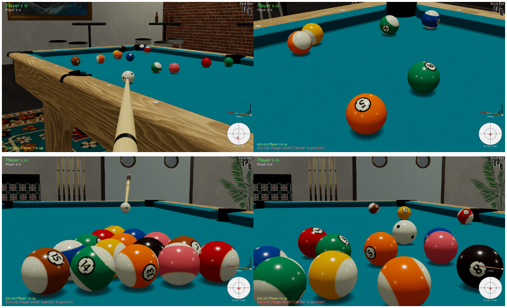

# Summary

Billiards, a broad classification for games like pool and snooker, supports a robust, multidisciplinary research and engineering community that investigates topics in physics, game theory, computer vision, robotics, and cue sports analytics. Central to these pursuits is the need for accurate simulation.

`pooltool` is a general-purpose billiards simulator crafted specifically for science and engineering. Its core design principles focus on speed, ease of visualization, and fine-grained analysis. It features customizable physics, an interactive 3D interface, a robust API, and extensive documentation, enabling users to easily simulate, visualize, and analyze billiards shots for generic research and engineering applications. Bolstered by a growing community and active development, `pooltool` aims to be a systemic tool for billiards-related research.

# Statement of need

Billiards simulation serves as the foundation for a wide array of research topics that collectively encompass billiards-related studies. Specifically, the application of game theory to develop AI billiards players has led to simulations becoming critical environments for the training of autonomous agents [@Smith2007-jq; @Archibald2010-av; @Fragkiadaki2015-oh; @Archibald2016-sd; @Silva2018-cm; @Chen2019-dk; @Tung2019-zu]. Meanwhile, billiards-playing robot research, which relies on simulations to predict the outcome of potential actions, has progressed significantly in the last 30 years and serves as a benchmark for broader advancements within sports robotics [@Sang1994-jv; @Alian2004-zs; @Greenspan2008-wg; @Nierhoff2012-st; @Mathavan2016-ck; @Bhagat2018-bx]. Billiards simulations also enrich computer vision (CV) capabilities, facilitating precise ball trajectory tracking and enhancing shot reconstruction for player analysis and training (for a review, see @Rodriguez-Lozano2023-hq). Additionally, through augmented reality (AR) and broadcast overlays, simulations have the potential to extend their impact by offering shot prediction and strategy formulation in contexts such as personal training apps and TV broadcasting, creating a more immersive understanding of the game.

Unfortunately, the current billiards simulation software landscape reveals a stark contrast between the realistic physics seen in some commercially-produced games (i.e., *Shooterspool* and *VirtualPool4*) and the limited functionality of open-source projects. Commercial products have little, if any, utility in research contexts due to closed source code and a lack of open APIs. Conversely, available open source tools lack realism, usability, and adaptability for generic research needs. The most widely cited simulator in research studies, *FastFiz*[^1], is unpackaged, unmaintained, provides no modularity for custom geometries or for physical models, offers restrictive 2D visualizations, outputs minimal simulation results with no built-in capabilities for introspection, and was custom built for hosting the Association for the Advancement of Artificial Intelligence (AAAI) Computational Pool Tournament from 2005-2008 [@Archibald2010-av]. Another option, *Billiards*[^2], offers a visually appealing 3D game experience, realistic physics, and supports customization via Lua scripting. However, as a standalone application, it lacks interoperability with commonly used systems and tools in research. Written in Lua, an uncommon language in the scientific community, it has limited appeal in research settings. The lack of Windows support is another drawback. *FooBilliard++*[^3] is a 3D game with realistic physics, yet is not a general-purpose billiards simulator, instead focusing on game experience and aesthetics. Other offerings suffer from drawbacks already mentioned.

The lack of suitable software for billiards simulation in research contexts forces researchers to develop case-specific simulators that meet their research requirements but fall short of serving the broader community as general-purpose simulators. This fragments the research collective, renders cross-study results difficult or impossible to compare, and leads to wasted effort spent reinventing the wheel. `pooltool` fills this niche by providing a billiards simulation platform designed with speed, flexibility, and extensibility in mind.

[^1]: [https://github.com/ekiefl/FastFiz](https://github.com/ekiefl/FastFiz)
[^2]: [https://www.nongnu.org/billiards/](https://www.nongnu.org/billiards/)
[^3]: [https://foobillardplus.sourceforge.net/](https://foobillardplus.sourceforge.net/)

# Implementation

`pooltool` is implemented as a Python package, and thus can be utilized within Python scripts, Jupyter notebooks, other Python packages, or any environment that supports Python.

`pooltool` employs an event-based simulation algorithm that significantly increases computational efficiency compared to traditional methods that rely on small, discrete time steps [@Leckie2006-cc]. By utilizing analytical formulations of the equations of motion in billiards, `pooltool` advances the system state directly to the next significant event—such as a collision or a change in a ball's motion—by precisely calculating when these events occur. To further increase efficiency, all computationally intensive portions of the shot evolution algorithm are accelerated with just-in-time (JIT) compilation using Numba [@siu_kwan_lam_2024_11642058], which compiles Python code to machine code at runtime.

`pooltool` includes an interactive 3D interface written with the Python game engine, *Panda3D* [^4]. The interface is a central feature of `pooltool` and can be launched either from the command line or directly through the Python API. It offers a controllable camera for visualizing shot trajectories in a realistic 3D environment, along with a comprehensive set of playback controls—including options to pause, slow down, rewind, and fast-forward shots. Beyond visualization, users can also interactively simulate shots in real time, utilizing game-like controls to stroke the cue stick via keyboard and mouse inputs. Additionally, shots can be programmatically generated and visualized, making it a flexible tool for both interactive play and scripted simulations.

[^4]: [https://www.panda3d.org/](https://www.panda3d.org/)

*Figure 1: Screenshots from the interactive interface.*

# Usage

Pooltool's API enables precise control over billiard system construction, simulation, and analysis. Up-to-date tutorials and examples can be found in the official documentation: [pooltool.readthedocs.io](https://pooltool.readthedocs.io/en/latest/).

# References
